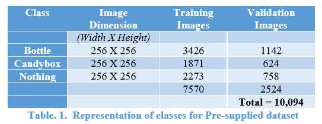
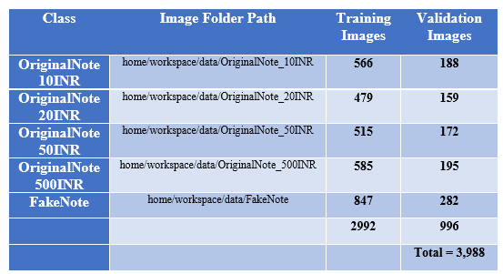
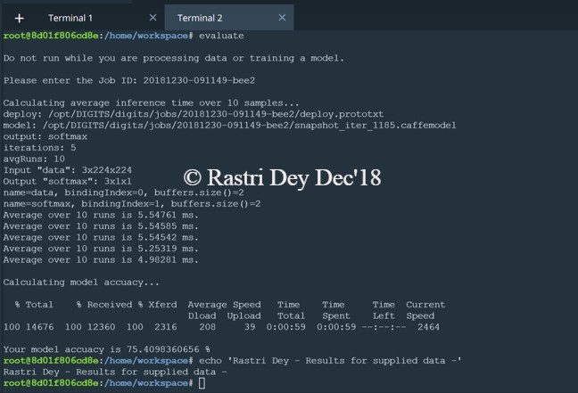
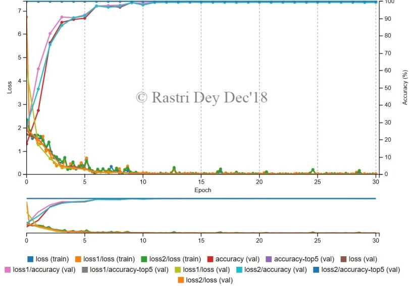

# RoboND_Project_Robotic_Inference

The Project explores an embedded robotics inference system, leveraging Nvidia’s Deep Learning tools, to create models on a DIGITS workflow platform that can be deployed in real time robotics applications. Real time image analysis and recognition of different features of Indian Bank Currency Notes– Original and Fake, using GoogLeNet neural network has been proposed.

## Data Acquisition

The Data Acquisition details in Training and Validation Image set can be represented as below:

## Results 

The results on Accuracy and Inference Time for supplied dataset:

Following curve shows the training loss, validation loss and accuracy levels for the INR Currency banknotes datasets, with a GoogLeNet architecture:

The prediction on test dataset with the trained classification model accurately determines all the test images with over 90% accuracy levels. The resulting predictions on test dataset is shown below: 

Hence we have our own Inference system for recognizing bank notes, one of the vital areas of research to prevent banknotes forgery, theft and currency frauds !!